# 🏏 IPL Phase Impact Analysis
### *Advanced Cricket Analytics using Python - Ball-by-Ball Data (2008–2025)*


---

## 📌 Project Overview

This project performs a **comprehensive phase-by-phase impact analysis** of IPL T20 cricket using **278,205 ball-by-ball deliveries** across **1,169 matches** from **2008 to 2025**.

The analysis is split into two parts:

- 📊 **Exploratory Data Analysis (EDA)** - Understanding the data, distributions, and trends
- 🎯 **Advanced Strategy Analytics** - The kind of insights real IPL teams use to build game plans

Every analysis comes with a **strategic insight** explaining what the numbers mean from a cricket tactics perspective.

---

## 🗂️ Project Structure

```
ipl_phase_analysis/
│
├── 📁 data/
│   └── ipl_data.csv               ← Ball-by-ball IPL dataset
│
├── 📁 notebooks/
│   ├── ipl_eda.ipynb              ← Exploratory Data Analysis
│   └── ipl_strategy_analytics.py ← Advanced Strategy Analysis (paste into Jupyter)
│
├── 📁 visuals/
│   ├── eda_01 → eda_06            ← EDA charts
│   └── strategy_01 → strategy_9   ← Strategy charts
│
├── README.md
└── requirements.txt
```

---

## 📦 Dataset

| Field | Details |
|-------|---------|
| **Source** | Kaggle — IPL Ball-by-Ball Dataset |
| **Coverage** | IPL 2008 – 2025 |
| **Rows** | 278,205 deliveries |
| **Matches** | 1,169 |
| **Venues** | 59 unique grounds |
| **Key Columns** | `over`, `ball`, `striker`, `bowler`, `runs_total`, `runs_batter`, `innings_score`, `innings_wickets`, `venue`, `toss_decision`, `match_winner`, `is_wicket` |

---

## ⚙️ Setup & Installation

```bash
# 1. Clone the repository
git clone https://github.com/YOUR_USERNAME/ipl-phase-analysis.git
cd ipl-phase-analysis

# 2. Create and activate environment
conda activate base
# or
python -m venv venv && source venv/bin/activate

# 3. Install dependencies
pip install -r requirements.txt

# 4. Launch Jupyter
jupyter notebook
```

---

## 📊 Part 1 — Exploratory Data Analysis

### What's covered:

**Data Cleaning & Feature Engineering**
- Converted 0-indexed overs to cricket overs (1–20)
- Extracted season year from match dates
- Assigned T20 phase labels (Powerplay / Middle / Death)
- Filled missing dismissal columns with contextual defaults

---

### EDA Visualisations

#### 1. Matches per IPL Season
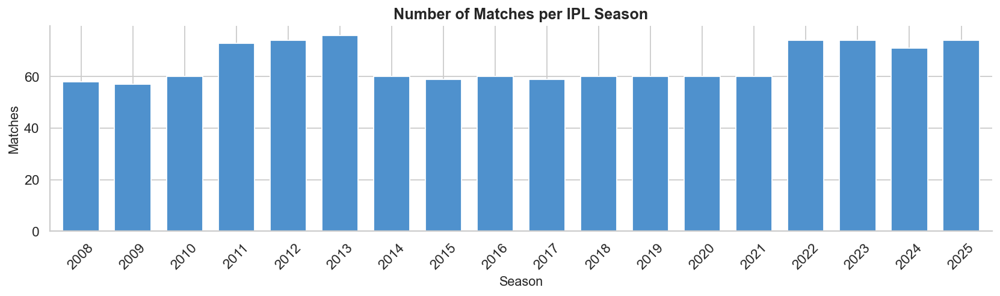
> Seasons 2011–2013 and 2022–2025 had the most matches due to expanded team formats. The 2020 season was played in the UAE due to COVID-19.

---

#### 2. Distribution of Runs per Delivery
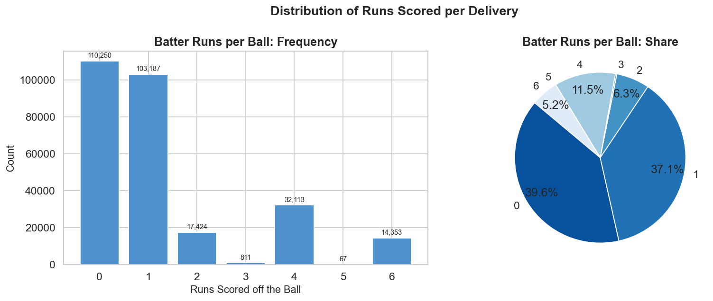
> Nearly **40% of all deliveries are dot balls** — reinforcing how premium scoring is in T20. Fours are the most common boundary, accounting for 11.5% of all balls.

---

#### 3. IPL Run Rate Trend by Season
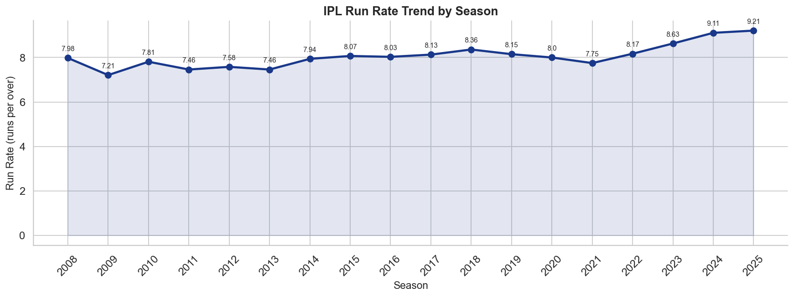
> Run rates have increased from ~7.98 in 2008 to **9.21 in 2025** — a 15% jump over 17 years, driven by better bats, aggressive mindsets, and shorter boundaries.

---

#### 4. Wicket Types Across All Seasons
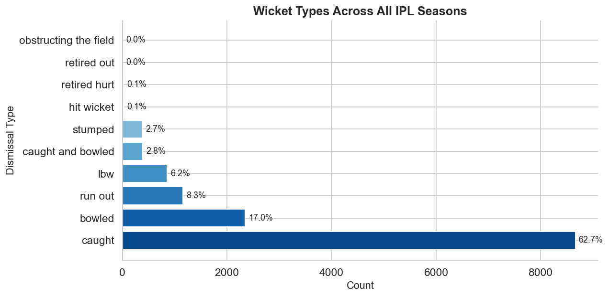
> **62.7% of all dismissals are caught** — highlighting how important fielding is in T20. Bowled accounts for 17%, confirming that good line-and-length still works even in high-scoring formats.

---

#### 5. Toss Analysis
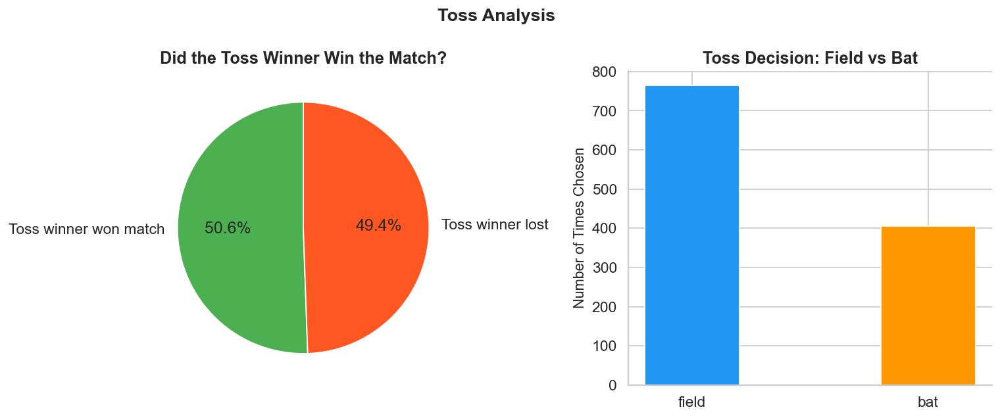
> Winning the toss gives only a **marginal advantage (50.6% win rate)**. However, teams overwhelmingly choose to **field first (65%)**, reflecting the known "chase advantage" in T20.

---

#### 6. T20 Phase Comparison — Key Metrics
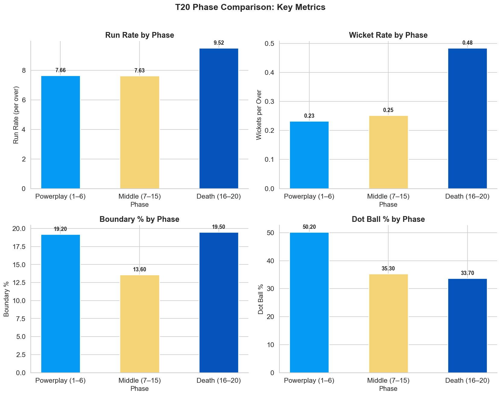
> Death Overs have the highest run rate (9.52) AND highest wicket rate (0.48) — the ultimate high-risk, high-reward phase. The Middle Overs show the highest dot ball % (35.3%), where bowlers build the most pressure.

---

## 🎯 Part 2 — Advanced Strategy Analytics

> *"The kind of analysis IPL team analysts use to build pre-match game plans."*

---

### Module 1 — Batting vs Bowling Matchups

#### Head-to-Head Strike Rate Heatmap
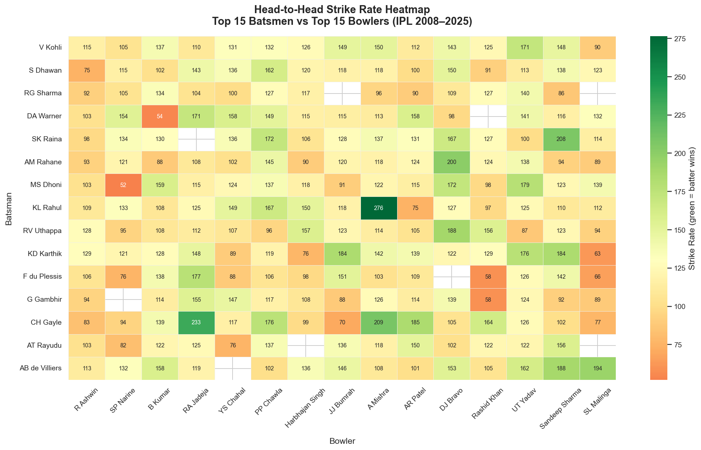
> Green = batter dominates | Red = bowler dominates | Grey = insufficient data (strategic unknown).
> Example insight: **KL Rahul scores at 276 SR against A Mishra** — a captain's nightmare matchup.

---

#### Economy Rate by Phase — Top Bowlers
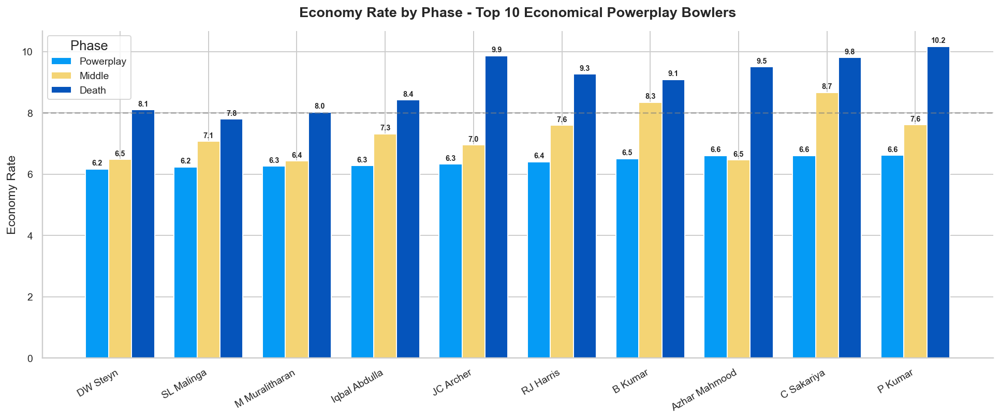
> Bowlers who stay below 8 RPO across all phases are rare and command premium auction prices. Most are **phase specialists** — best deployed in specific windows.

---

### Module 2 — Venue & Pitch Impact

#### Average 1st Innings Score by Venue
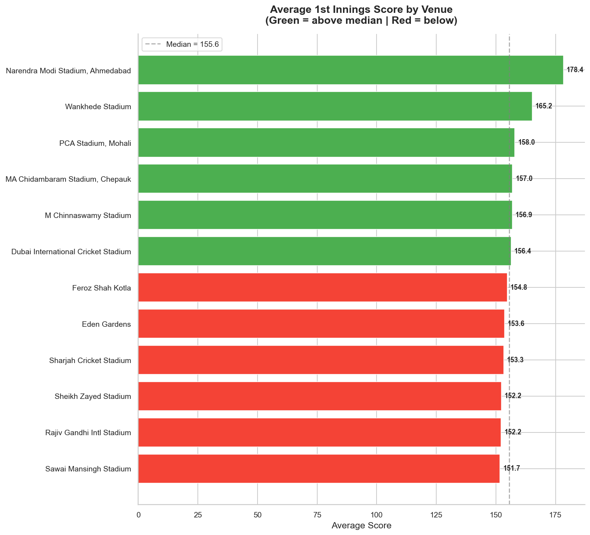
> **Narendra Modi Stadium (178.4)** is the most batting-friendly ground. **Sawai Mansingh Stadium (151.7)** is the toughest to bat on. Knowing the venue par score is critical for toss and batting order decisions.

---

#### Venue Profile: Batting Index vs Wickets Lost
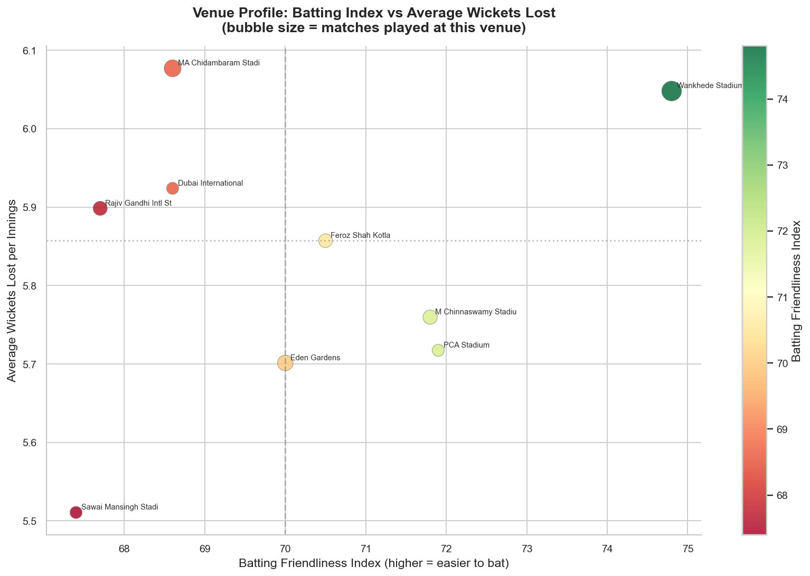
> **Wankhede Stadium** sits in the top-right — both batting-friendly AND high wicket-fall. **Sawai Mansingh** is bottom-left — slow, low-scoring, and suits disciplined bowling attacks.

---

### Module 3 — Chasing vs Defending

#### Chase vs Defend Win Rate by Target Bracket
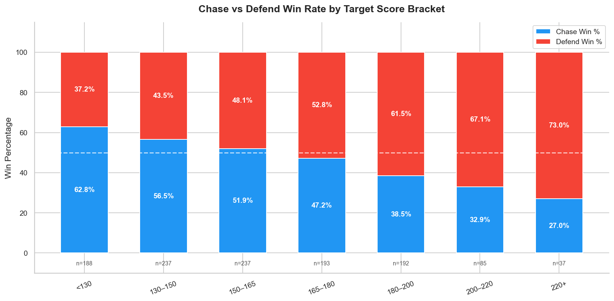

| Target Range | Chase Win % | Verdict |
|-------------|-------------|---------|
| < 130 | 62.8% | 🔵 Chase heavily favoured |
| 130–165 | ~54% | 🔵 Slight chase advantage |
| 165–180 | 47.2% | ⚖️ Near coin-flip |
| 180–200 | 38.5% | 🔴 Defend favoured |
| 200+ | 27–32% | 🔴 Defending team wins most |

---

#### Chase Win Rate by IPL Season
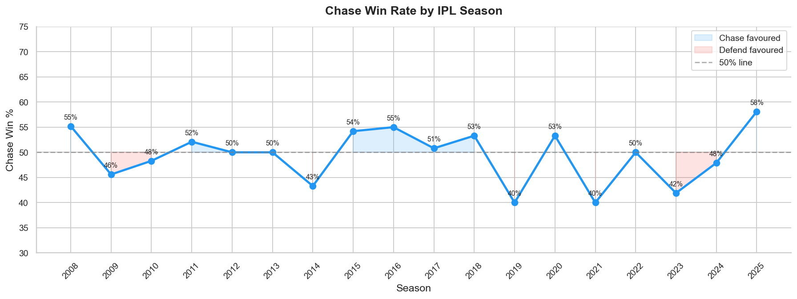
> Chase win rates fluctuate year-to-year but have trended upward in recent seasons (58% in 2025), suggesting teams are getting better at chasing with data-driven batting strategies.

---

#### Required Run Rate Win Probability at Over 15
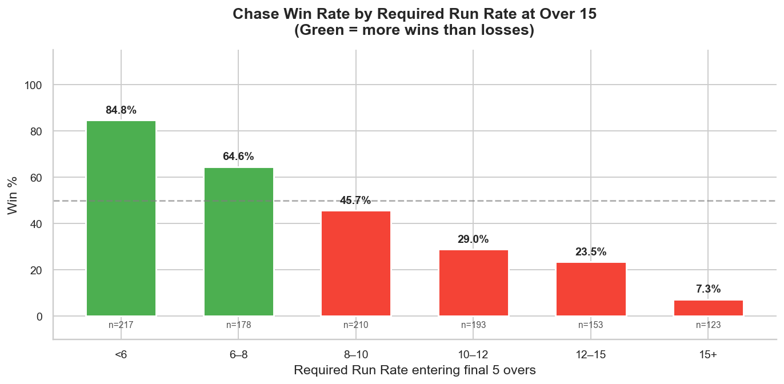

| RRR at Over 15 | Win % |
|----------------|-------|
| < 6 | 84.8% ✅ |
| 6–8 | 64.6% ✅ |
| 8–10 | 45.7% ⚠️ |
| 10–12 | 29.0% ❌ |
| 12+ | < 24% ❌ |

> The **8 RPO line at over 15** is the strategic cut-off — above it, win probability drops sharply. Teams use this to pace their Middle Overs batting.

---

### Module 4 — Bowler Pressure Index

#### Top Pressure Bowlers by Phase
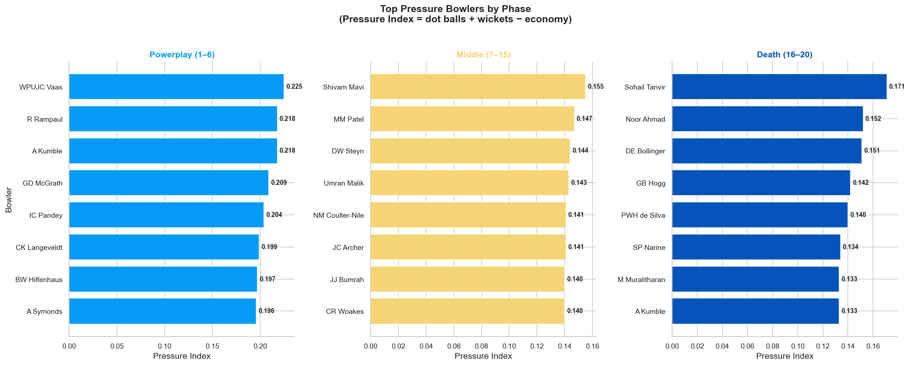
> **Pressure Index = (dot ball % × 0.40) + (wicket rate × 0.40) − (economy × 0.20)**
> Goes beyond standard economy/wickets to measure how much psychological pressure a bowler creates. Dot balls force mistakes → mistakes create wickets.

---

### Module 5 — Strategy Dashboard
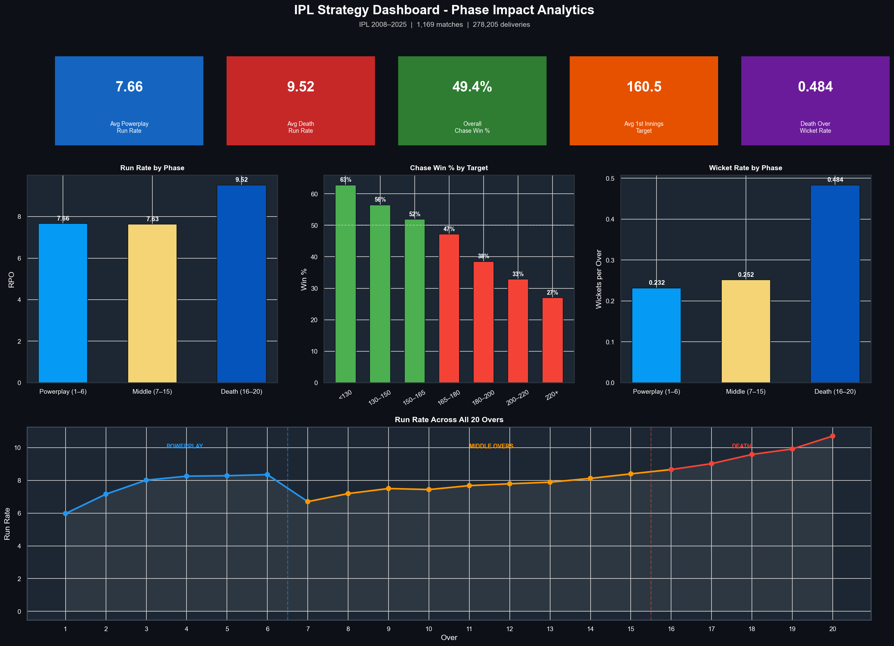
> A one-page pre-match briefing view combining all key KPIs — run rates, chase win %, wicket rates, and the over-by-over scoring shape across all 20 overs.

---

## 💡 Key Insights Summary

| # | Insight |
|---|---------|
| 1 | IPL run rates have grown **15% in 17 years** (7.98 → 9.21 RPO) |
| 2 | **40% of deliveries are dot balls** — building pressure is as valuable as taking wickets |
| 3 | Death Overs have **2x the wicket rate** of Powerplay (0.484 vs 0.232) |
| 4 | Chasing targets **above 185 is won less than 40% of the time** |
| 5 | Teams needing **>10 RPO at over 15** win less than 30% of the time |
| 6 | **Narendra Modi Stadium** averages 178.4 — 27 runs higher than the toughest venue |
| 7 | Toss advantage is essentially **a coin flip (50.6%)** despite the chase preference |
| 8 | **62.7% of dismissals are caught** — fielding is as important as bowling in T20 |

---

## 🛠️ Tools Used

| Tool | Purpose |
|------|---------|
| `pandas` | Data loading, cleaning, aggregation |
| `matplotlib` | Custom charts, dashboard |
| `seaborn` | Statistical visualisations, heatmaps |
| `numpy` | Numerical operations, radar charts |
| `jupyter` | Interactive notebook environment |

---

## 📄 Requirements

```
pandas>=2.0
matplotlib>=3.7
seaborn>=0.13
numpy>=1.24
jupyter>=1.0
notebook>=7.0
```

Install all with:
```bash
pip install -r requirements.txt
```

---

## 🚀 How to Run

```bash
# EDA Notebook
jupyter notebook notebooks/ipl_eda.ipynb

# Strategy Analytics
# Open a new notebook and paste each CELL block from:
notebooks/ipl_strategy_analytics.py
# Run cells top to bottom (Cell 1 → Cell 13)
```

---

## 📁 All Visualisations

| File | Description |
|------|-------------|
| `eda_01_matches_per_season` | Matches played per IPL season |
| `eda_02_runs_distribution` | Frequency & share of runs per delivery |
| `eda_03_run_rate_trend` | Run rate evolution 2008–2025 |
| `eda_04_wicket_types` | Dismissal type breakdown |
| `eda_05_toss_analysis` | Toss win vs match win correlation |
| `eda_06_phase_comparison` | 4-metric phase comparison dashboard |
| `strategy_01_matchup_heatmap` | Batsman vs bowler SR heatmap |
| `strategy_02_bowler_phase_economy` | Economy by phase — top bowlers |
| `strategy_03_venue_avg_score` | Average 1st innings score by venue |
| `strategy_04_venue_profile_scatter` | Batting index vs wickets scatter |
| `strategy_05_chase_defend_brackets` | Chase vs defend by target bracket |
| `strategy_06_chase_win_trend` | Chase win % by season |
| `strategy_07_rrr_win_rate` | Win % by required run rate at over 15 |
| `strategy_08_pressure_index_by_phase` | Top pressure bowlers per phase |
| `strategy_09_bowler_radar` | Radar profiles — top 6 bowlers |
| `strategy_10_dashboard` | Full strategy dashboard |

---

## 👩‍💻 Author

**Akshita Siddhapura**
📧 Connect on [LinkedIn](https://www.linkedin.com/in/akshita-siddhapura/)

---

## 📜 License

This project is licensed under the MIT License - feel free to use, modify and share with attribution.
